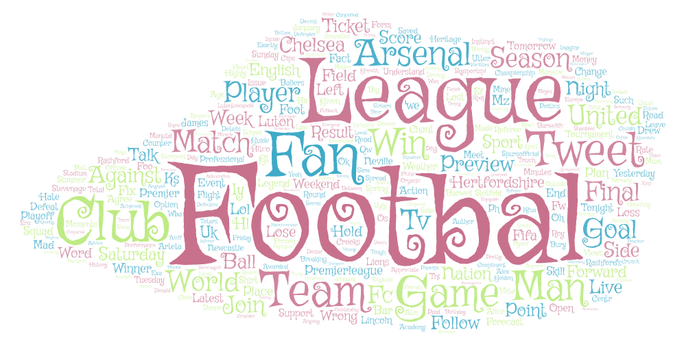
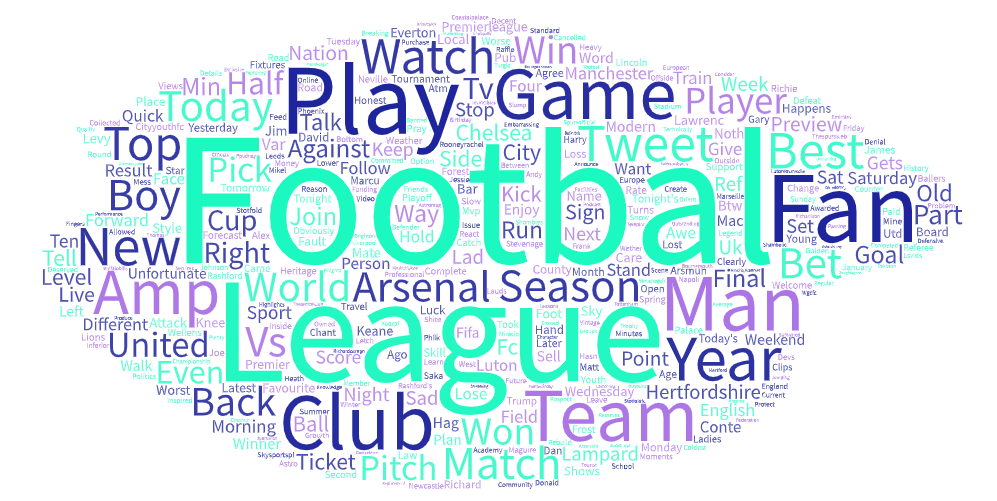
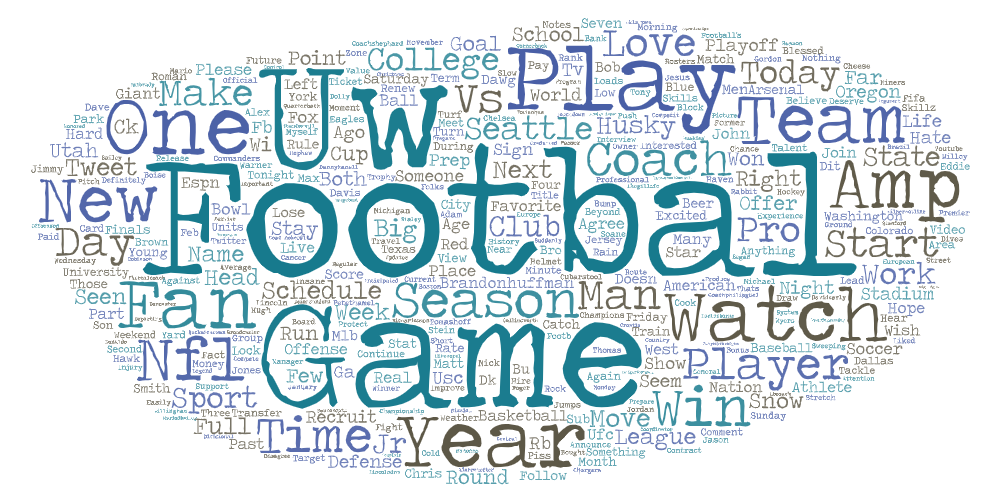

# GEOG458 - Lab 2: Geo-tagged tweet collection and visualization
## Jasmine So 

For Lab 2. I have focused on collecting tweets containing the discussion of **“Football”** from **"2022-4-1"** in **three** different places with the same set of search parameters. 

Three word clouds are created after deleting the meaningless terms. Thus, the parameters I have used for search include `“Football”` as the search word, the longitude and latitude of the chosen location, the radius is `30 miles` which allows the buffer to cover the area where the data will be collected, and `“2022-4-1”` for date since. I chose this specific date because I wanted to collect data for a few months during the league competitions, and before the World Cup started. 

I have chosen three different locations to collect the data with the same set of search parameters. The three locations are `London`, `Hong Kong`, and `Seattle`. 

**Footbal** sometimes refers to different sports in these three cities. I would like to compare the results and see what people are interested in when focusing on `“Football”`. 

The three word clouds created are in the following: 

In London, football is one of the most popular sports, in terms of both participants and spectators. London has some leading football clubs and is home to seventeen professional clubs, such as Chelsea and Tottenham Hotspur.
[Result spreadsheets of London](assets/twsearch-result-1-London.csv)

Hong Kong is also a big fan of football. People in Hong Kong not only watch The Hong Kong Premier League, but also the games in the United Kingdom. 
[Result spreadsheets of Hong Kong](assets/twsearch-result-2-HongKong.csv)

Unlike London and Hong Kong, in the United States, football mainly refers to the NFL. It is a totally different kind of sport with different rules. American football is the most popular in the United States, followed by Mexico and Canada. 
[Result spreadsheets of Seattle](assets/twsearch-result-3-Seattle.csv)

These three word clouds have various similarities and differences. 

First of all, “football” is the most mentioned term in all three word clouds. As I set the search term “football”, the most tweet result responded is definitely the same word. We can also see the word “team” appeared a lot among the three word clouds. People are interested in the teams playing certain games. Additionally, we can see the words `“Fan”`, `“Sport”`, `“League”`, `“Win”`, `“Preview”`. People watch the recaps of games on Twitter a lot. On the other hand, `“college”`, `“state”` are the only words that can be seen on word cloud 3 (Seattle) because of college games and the NFL. 

Focusing on the word clouds of London and Hong Kong as these two cities have similar meaning of “Football”. The tweet search keywords are mainly `“Club”`, `“Chelsea”`, `“Arsenal”`, `“Messi”`, `“Man”`, `“World”`. We can tell that these keywords are about Premier League Games and the Qatar World Cup which just happened. `“Chelsea”`, `“Arsenal”`, and `“Man”` are referring to the **“Clubs”** in Football. `“World”` and `“Messi”` are referring to the World Cup because Argentina won the World Cup this year. `“Messi”` is a very important keyword to football fans.  

Among these three word clouds, I found the similarities and differences very interesting. *Football** means a lot to these three cities. Thus, the search results varied correspondingly. 

I expected `“Messi”` to show up on one of these word clouds because most football fans were excited about the World Cup this year. I was surprised that the keyword `“NFL”` is shown on the Hong Kong word cloud because I did not know people in Hong Kong are interested in American Football. 
